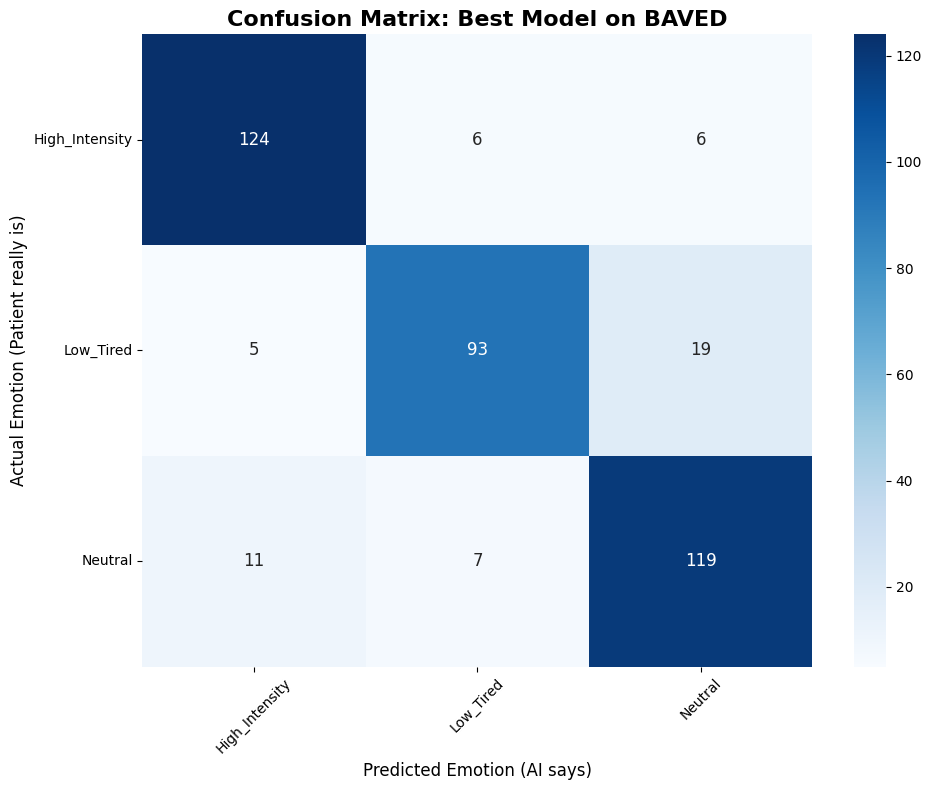
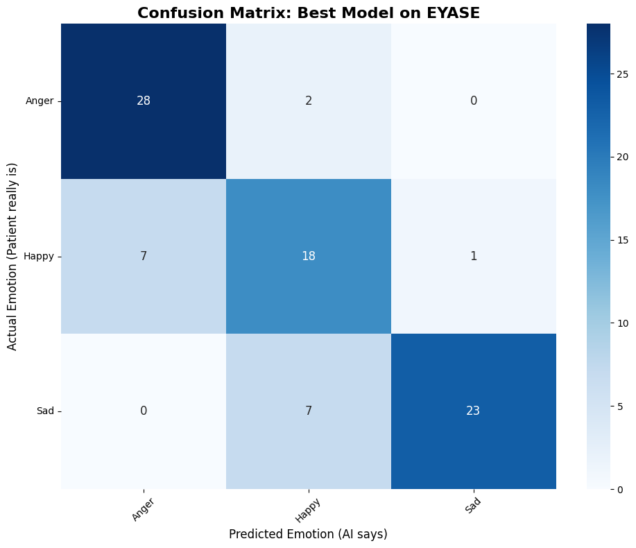

<div align="center">

# 🧠 PACE – Egyptian Psychiatric Speech Analytics

### *A High-Performance Multimodal AI Framework for Egyptian Arabic Psychotherapy Session Analysis*

[](https://www.python.org/)
[](https://pytorch.org/)
[](https://huggingface.co/docs/transformers/index)
[](https://fastapi.tiangolo.com/)

<br>

[](https://am4magdy-pace-egyptian-psychiatric-speech-analytics.hf.space)
[](https://huggingface.co/am4magdy/Baved_3e5b16)
[](https://huggingface.co/am4magdy/egyptian-whisper-large-v3-standalone)

</div>

---

# 📖 Overview

A Kaggle-native, multi-GPU asynchronous AI framework for Egyptian Arabic psychiatric speech analytics. Integrates late decision-level multimodal fusion (Wav2Vec2 + Whisper V3 Large + CAMeLBERT) with Qwen-powered clinical report generation.

Traditional SER setups struggle with long-form clinical audio and dialectal shifts. PACE bridges this gap via a production-grade asynchronous pipeline that ingests raw sessions, handles dynamic noise reduction, splits records into synchronized 30-second tensor windows, and parallelizes multi-model execution across isolated GPU lanes.

> ⚠️ **Disclaimer:** PACE is intended exclusively for academic research and clinical decision support. It is not a certified medical diagnostic system and does not replace professional psychiatric evaluation.

---

# ☁️ Architecture: The Zero-Token Kaggle Pipeline

**Notice: There is no local environment setup for this project.**

PACE runs four massive transformer models concurrently. Attempting to execute this stack on a standard local machine will instantly result in Out-Of-Memory (OOM) crashes. 

To solve this, **the project is designed exclusively to run on Kaggle's dual T4 GPU environment** utilizing a strict MLOps decoupling strategy:
1. **Zero-Token Offline Models:** Instead of pulling models from Hugging Face APIs, the architecture binds directly to Kaggle's internal `/kaggle/input/` datasets. This drastically reduces network bottlenecks and removes the need for `HF_TOKEN` authentications.
2. **Zero-Token Networking:** We utilize `Localtunnel` inside the Kaggle kernel to expose the internal FastAPI endpoints to a public, interactive frontend without requiring Ngrok accounts or authentication keys.
3. **Dynamic Resource Chunking:** The engine programmatically intercepts massive audio uploads, mathematically forces them into safe 30-second processing windows, and resolves the streams before memory degradation occurs.

---

# 🏗️ System Architecture & Multimodal Pipeline

PACE adopts a **Late Decision-Level Multimodal Fusion Architecture**. Individual AI models execute isolated feature extractions on independent hardware threads before merging representations to drive the clinical summary pipeline.

```text
                        Therapy Session Audio File (.wav)
                                │
                                ▼
         Dynamic 16kHz Mono Resampling & Noise Reduction (80% Mask)
                                │
                                ▼
                 Dynamic 30-Second In-Memory Slicing
                                │
              ┌─────────────────┴─────────────────┐
              ▼ (Executed on CUDA:1)              ▼ (Executed on CUDA:1)
     Acoustic Emotion Recognition         Egyptian Whisper ASR Engine
       Fine-Tuned Wav2Vec2-Base           LoRA-Adapted Whisper Large V3
              │                                   │
              ▼                                   ▼
      Acoustic Emotion Labels          CAMeLBERT Semantic Sentiment
       [High_Intensity, Low_Tired]       (Executed on CUDA:0 Stream)
              │                                   │
              └─────────────────┬─────────────────┘
                                │
                                ▼
                 Asynchronous Session Emotion Timeline
                                │
                                ▼ (Executed on CUDA:0 Lane)
                  Qwen Gen-Report Clinical LLM Engine
                                │
                                ▼
            Structured Psychiatric Diagnostic Assessment Report
```

---

# 🤖 Core AI Model Stack

1. **Acoustic Emotion Recognition (SER/AER):** Fine-tuned `facebook/wav2vec2-base` (Deployed: [am4magdy/Baved_3e5b16](https://huggingface.co/am4magdy/Baved_3e5b16)). Extracts language-agnostic features.
2. **Egyptian Arabic Speech Recognition (ASR):** LoRA-adapted `Whisper-Large-V3` (Deployed: [am4magdy/egyptian-whisper-large-v3-standalone](https://huggingface.co/am4magdy/egyptian-whisper-large-v3-standalone)). Tuned for complex Egyptian vernacular.
3. **Semantic Emotion Analysis:** `CAMeLBERT` model executing localized Arabic text-classification.
4. **Clinical Report Generation:** `Qwen-1.5B` customized with specialized repetition penalties to produce clean clinical diagnostic narratives.

---

# 📊 Benchmark Accuracies

| Dataset | Best Performing Backbone | Learning Rate | Batch Size | Validation Accuracy |
| :--- | :--- | :---: | :---: | :---: |
| **BAVED** (Arabic Context) | `wav2vec2-base` | 3e-05 | 16 | **86.15%** |
| **EYASE** (Egyptian Vernacular) | `wav2vec2-base` | 5e-05 | 8 | **80.23%** |
| **CREMA-D** (Real-World English) | `wav2vec2-base` | 5e-05 | 8 | **77.84%** |
| **TESS** (Controlled Studio Environment) | `wav2vec2-base` | 3e-05 | 8 | **100.0%** |

<p align="center">
  
  
</p>

---

# 📂 Repository Infrastructure

```text
PACE-Egyptian-Psychiatric-Speech-Analytics/
│
├── requirements.txt                # Pinned microservice and deep learning package versions
├── index.html                      # The decoupled Vanilla JS & HTML clinical dashboard interface
│
├── app/                            # Core FastAPI Backend Module
│   ├── __init__.py
│   ├── config.py                   # Kaggle native model path configurations
│   ├── ml_models.py                # Hardware allocation & heavy transformer initialization
│   ├── services.py                 # 30-sec Audio chunking, inference pipelines, and LLM reasoning
│   ├── router.py                   # FastAPI endpoints 
│   └── main.py                     # ASGI server entry point
│
├── Notebooks/                      
│   ├── 01_Training.ipynb           # Data preparation, hyperparameter sweeps, and model fine-tuning
│   └── 02_Evaluation.ipynb         # Quantitative analysis, metrics reporting, and confusion matrices
│
└── assets/                         # Evaluation plots and confusion graphs
```

---

# 🚀 Deployment & Execution (One-Click Kaggle Runner)

To bypass local hardware limitations, we have prepared a pre-configured Kaggle Deployment Template with all necessary transformer models attached and dual GPUs provisioned.

1. Open the **[PACE Kaggle Deployment Template](https://www.kaggle.com/code/ahmed4magdy/pace-production)**
2. Click **"Copy & Edit"** in the top right corner. (This forks the environment to your Kaggle account using your free quota).
3. Ensure the Accelerator in the right-hand panel is set to **GPU T4 x2**.
4. Click **"Run All"**.
5. The notebook will automatically pull this repository, restart the kernel, boot the engine across both GPUs, and generate a secure, zero-token `Localtunnel` URL at the bottom of the output. Click it to access the clinical dashboard.

---

# 🔮 Future Work: Clinical Psychiatric Taxonomy Expansion

Current speech analytics focus on broad arousal descriptors (*High Intensity*, *Low Tired*). Future milestones will expand the classification scope toward granular clinical speech phenotypes mapped directly to DSM-5 diagnostic frameworks:
* **Affective Flattening:** Tracking blunted pitch variants associated with depressive or negative schizophrenic phases.
* **Anxiety and Panic Signatures:** High-frequency tremor tracking and rapid speaking rate variations.
* **Pressured Speech Metrics:** Quantifying hyper-accelerated speech flows indicating mania patterns.

---

# 📚 Citation & Metadata

```bibtex
@misc{Magdy2026PACE,
  author = {Ahmed Magdy Hassan},
  title = {PACE: Multimodal Egyptian Psychiatric Speech Analytics Engine},
  year = {2026},
  publisher = {GitHub},
  url = {[https://github.com/Sober-Migo/PACE-Egyptian-Psychiatric-Speech-Analytics](https://github.com/Sober-Migo/PACE-Egyptian-Psychiatric-Speech-Analytics)}
}
```

---

# 👨‍💻 Author & Acknowledgments

* **Developer:** Ahmed Magdy Hassan
* **Acknowledgments:** Built using foundational open-source toolkits provided by Meta AI, OpenAI, CAMeL Lab, Alibaba Cloud, and Hugging Face.

<div align="center">
<br>
👑 <b>If this implementation helped your clinical health-tech architectures, consider giving it a Star!</b>
</div>
