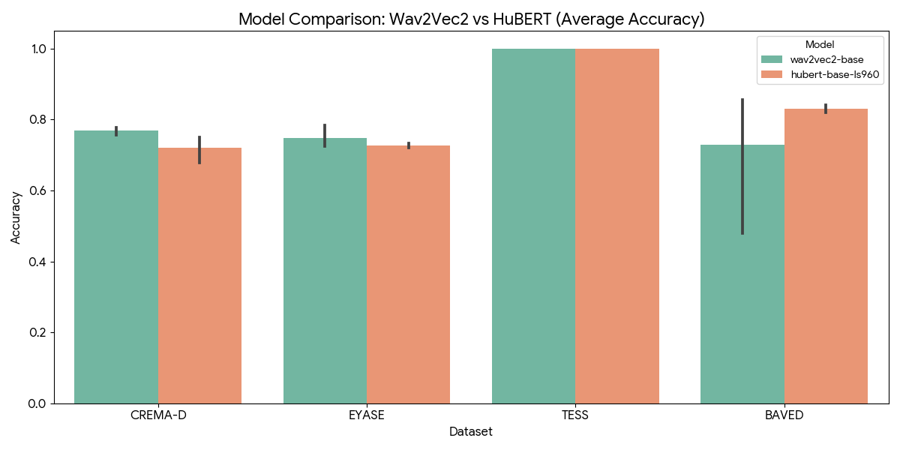
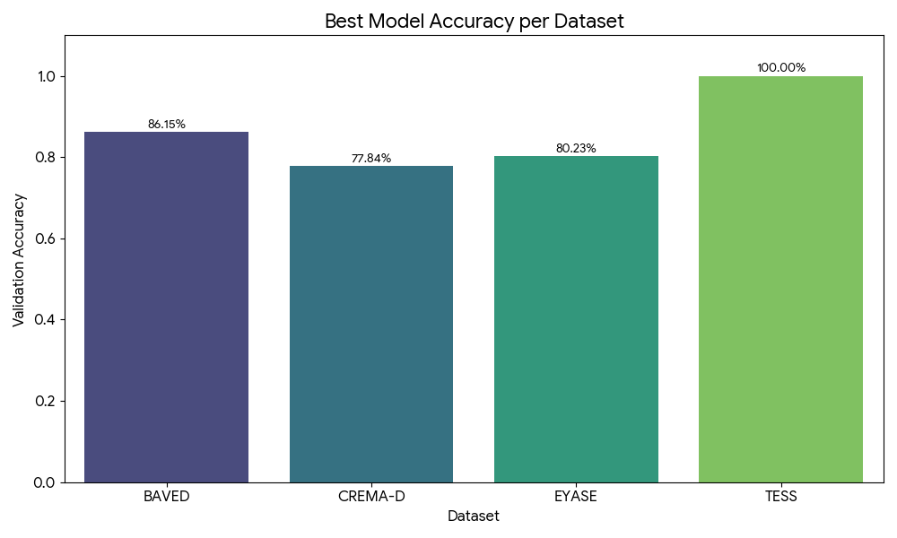
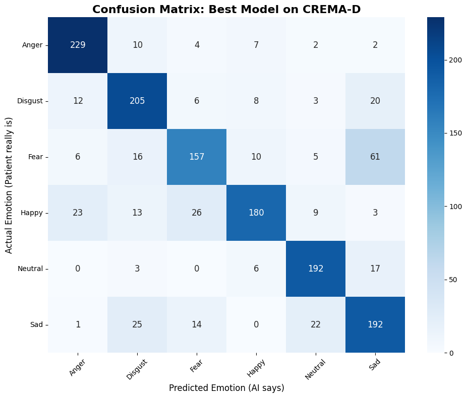
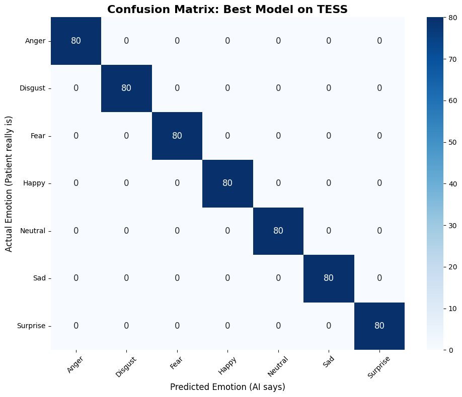

<div align="center">

# 🧠 PACE – Egyptian Psychiatric Speech Analytics

### *A High-Performance Multimodal AI Framework for Egyptian Arabic Psychotherapy Session Analysis*

[](https://www.python.org/)
[](https://pytorch.org/)
[](https://huggingface.co/docs/transformers/index)
[](https://fastapi.tiangolo.com/)
[]()

<br>

[](https://am4magdy-pace-egyptian-psychiatric-speech-analytics.hf.space)
[](https://huggingface.co/am4magdy/Baved_3e5b16)
[](https://huggingface.co/am4magdy/egyptian-whisper-large-v3-standalone)

</div>

---

# 📖 Overview

**PACE (Psychiatric Analytics Core Engine)** is an enterprise-ready multimodal AI framework engineered to power therapist-patient mental health platforms through automated, high-fidelity vocal and semantic session analysis. Deployed natively inside high-throughput architectures, PACE decouples acoustic speech characteristics from dialect-specific textual semantics to construct continuous chronological session timelines, enabling large language models to generate structured psychiatric assessments.

Traditional SER setups struggle with long-form clinical audio and dialectal shifts. PACE bridges this gap via a production-grade asynchronous pipeline that ingests raw sessions, handles dynamic noise reduction, splits records into synchronized 30-second tensor windows, and parallelizes multi-model execution across isolated GPU lanes without system deadlocks.

> ⚠️ **Disclaimer:** PACE is intended exclusively for academic research and clinical decision support. It is not a certified medical diagnostic system and does not replace professional psychiatric evaluation.

---

# ☁️ Hardware Architecture: The Kaggle Dependency

**Notice: There is no local environment setup for this project.**

PACE runs four massive transformer models concurrently (`Whisper V3 Large`, `Qwen 1.5B`, `Wav2Vec2`, and `CAMeLBERT`). Attempting to execute this full stack on a standard local machine or a free-tier cloud instance will instantly result in Out-Of-Memory (OOM) crashes.

To solve this, **the project is designed exclusively to run on Kaggle's dual T4 GPU environment.** We have adopted a strict MLOps decoupling strategy:
1. **The Codebase (This Repository):** Contains the clean, modular backend API, frontend UI, and routing logic.
2. **The Compute Runner (Kaggle):** The included `03_Model_API.ipynb` acts as a deployment runner. It clones this repository directly into a Kaggle kernel, distributes the heavy AI models across `CUDA:0` and `CUDA:1`, securely injects environment variables, and exposes the FastAPI server to the web.

---

# 🏗️ System Architecture & Multimodal Pipeline

PACE adopts a **Late Decision-Level Multimodal Fusion Architecture**. Individual AI models execute isolated feature extractions on independent hardware threads before merging representations to drive the clinical summary pipeline.

```text
                        Therapy Session Audio File (.wav)
                                │
                                ▼
         Dynamic 16kHz Mono Resampling & Noise Reduction (80% Mask)
                                │
                                ▼
                 Dynamic 30-Second In-Memory Slicing
                                │
              ┌─────────────────┴─────────────────┐
              ▼ (Executed on CUDA:1)              ▼ (Executed on CUDA:1)
     Acoustic Emotion Recognition         Egyptian Whisper ASR Engine
       Fine-Tuned Wav2Vec2-Base           LoRA-Adapted Whisper Large V3
              │                                   │
              ▼                                   ▼
      Acoustic Emotion Labels          CAMeLBERT Semantic Sentiment
       [High_Intensity, Low_Tired]       (Executed on CUDA:0 Stream)
              │                                   │
              └─────────────────┬─────────────────┘
                                │
                                ▼
                 Asynchronous Session Emotion Timeline
                                │
                                ▼ (Executed on CUDA:0 Lane)
                  Qwen Gen-Report Clinical LLM Engine
                                │
                                ▼
            Structured Psychiatric Diagnostic Assessment Report
```

---

# 🤖 Core AI Model Stack

1. **Acoustic Emotion Recognition (SER/AER):** Fine-tuned `facebook/wav2vec2-base` (Deployed: [am4magdy/Baved_3e5b16](https://huggingface.co/am4magdy/Baved_3e5b16)). Extracts language-agnostic features (pitch, spectral density, energy) to isolate arousal shifts.
2. **Egyptian Arabic Speech Recognition (ASR):** LoRA-adapted `Whisper-Large-V3` (Deployed: [am4magdy/egyptian-whisper-large-v3-standalone](https://huggingface.co/am4magdy/egyptian-whisper-large-v3-standalone)). Tuned to handle complex Egyptian vernacular expressions, code-switching, and clinical slang.
3. **Semantic Emotion Analysis:** [CAMeLBERT](https://huggingface.co/camel-lab/camelbert-ca-sentiment) model executing localized Arabic text-classification to determine linguistic valence, complementing raw acoustic metrics.
4. **Clinical Report Generation:** [Qwen](https://huggingface.co/Qwen) Text-Generation Engine customized with specialized repetition penalties, low-temperature constraints, and punctuation token-suppression loops to produce clean clinical diagnostic narratives.

---

# 🛠️ MLOps Engineering & Optimization Highlights

* **Multi-GPU Workload Balancing:** Implemented strict hardware-level synchronization barriers utilizing separate PyTorch CUDA streams. Heavy text-generation pipelines are pinned on `cuda:0`, while transcription and dense convolutional acoustic layers run on `cuda:1`, eliminating memory leakage and VRAM over-allocation.
* **Micro-Batching Optimization:** Tuned the active batch generation framework (`BATCH_SIZE_LIMIT = 8`) during beam search configurations, stabilizing peak memory footprints and preventing OOM crashes during long clinical runs.
* **Signal Resampling and Masking:** Integrates non-stationary noise-reduction routines via `noisereduce` with an intentional 80% decrease factor alongside strict 16,000Hz mono resampling to eradicate environment distortions while protecting delicate emotional prosody.

---

# 📊 Hyperparameter Grid Search & Benchmarks

A rigorous hyperparameter grid search evaluated model boundaries over controlled 3-epoch execution runs, establishing `Wav2Vec2` as the optimal acoustic encoder over `HuBERT` setups.

### 🏆 Best Hyperparameter Configurations Matrix

| Dataset | Best Performing Backbone | Learning Rate | Batch Size | Validation Accuracy |
| :--- | :--- | :---: | :---: | :---: |
| **BAVED** (Arabic Context) | `wav2vec2-base` | 3e-05 | 16 | **86.15%** |
| **EYASE** (Egyptian Vernacular) | `wav2vec2-base` | 5e-05 | 8 | **80.23%** |
| **CREMA-D** (Real-World English) | `wav2vec2-base` | 5e-05 | 8 | **77.84%** |
| **TESS** (Controlled Studio Environment) | `wav2vec2-base` | 3e-05 | 8 | **100.0%** |

<p align="center">
  
  
</p>

### 📈 Detailed Performance Metrics & Confusion Matrices

The fine-tuned acoustic engine's class-wise discrimination capability was validated using confusion matrices across distinct language profiles, recording backgrounds, and clinical arousal intensities:

* **BAVED Confusion Matrix:** Demonstrates highly stable class alignment on formal and informal Arabic speech tokens, maintaining clean true-positive detection tracking for target psychological distress attributes.
* **EYASE Confusion Matrix:** Validates structural resilience against colloquial Egyptian Arabic dialects, effectively matching native vocal expressions into baseline behavioral dimensions without semantic interference.
* **CREMA-D Confusion Matrix:** Evaluates cross-domain out-of-distribution robustness utilizing multi-speaker real-world English recordings, prioritizing clinical diagnostic safety through a reliable high-recall profile.
* **TESS Confusion Matrix:** Confirms baseline statistical boundaries under controlled laboratory studio conditions, delivering ideal feature isolation boundaries.

<p align="center">
  
  
</p>
<p align="center">
  
  
</p>

---

# 📂 Repository Infrastructure

The layout is strictly modularized to separate the backend core API layer from the frontend visualization and the deployment configurations:

```text
PACE-Egyptian-Psychiatric-Speech-Analytics/
│
├── .env.example                    # Template for environment secrets (HF_TOKEN)
├── requirements.txt                # Pinned microservice and deep learning package versions
├── index.html                      # The decoupled Vanilla JS & HTML clinical dashboard interface
│
├── app/                            # Core FastAPI Backend Module
│   ├── __init__.py
│   ├── config.py                   # Secure environment variables & authentication
│   ├── ml_models.py                # Hardware allocation & heavy transformer initialization
│   ├── services.py                 # Audio chunking, inference pipelines, and LLM reasoning
│   ├── router.py                   # FastAPI endpoints & background tasks
│   └── main.py                     # ASGI server entry point
│
├── Notebooks/                      
│   ├── 01_Training.ipynb           # Data preparation, hyperparameter sweeps, and model fine-tuning
│   ├── 02_Evaluation.ipynb         # Quantitative analysis, metrics reporting, and confusion matrices
│   └── 03_Model_API.ipynb          # THE KAGGLE RUNNER: Boots the repo directly into Kaggle GPUs
│
└── assets/                         # Evaluation plots, benchmark visualizations, and confusion graphs
    ├── HuBERT_vs_Wav2Vec2.png
    ├── best_accuracy_per_dataset.png
    ├── confusion_matrix_BAVED.png
    ├── confusion_matrix_CREMA-D.png
    ├── confusion_matrix_EYASE.png
    └── confusion_matrix_TESS.png
```

---

# 🚀 Deployment & Execution (Kaggle Only)

To test the application, deploy it directly to a Kaggle Notebook utilizing their dual GPU hardware.

1. Create a new Notebook on Kaggle.
2. In the Session Options on the right panel, set the **Accelerator** to **GPU T4 x2**.
3. Open the **Add-ons -> Secrets** tab. Add your `HF_TOKEN` (Hugging Face) and `NGROK_TOKEN` (PyNgrok).
4. Upload or copy the contents of `Notebooks/03_Model_API.ipynb` into your Kaggle Notebook.
5. **Run all cells.** The notebook will dynamically clone this repository, install the exact pinned `requirements.txt`, load the backend architecture across both GPUs, and output a secure Ngrok URL. Click the URL to interact with the full UI.

---

# 🔮 Future Work: Clinical Psychiatric Taxonomy Expansion

Current speech analytics focus on broad arousal descriptors (*High Intensity*, *Low Tired*). Future milestones will expand the classification scope toward granular clinical speech phenotypes mapped directly to DSM-5 diagnostic frameworks:
* **Affective Flattening:** Tracking blunted pitch variants associated with depressive or negative schizophrenic phases.
* **Anxiety and Panic Signatures:** High-frequency tremor tracking and rapid speaking rate variations.
* **Pressured Speech Metrics:** Quantifying hyper-accelerated speech flows indicating mania patterns.

---

# 📚 Citation & Metadata

```bibtex
@misc{Magdy2026PACE,
  author = {Ahmed Magdy Hassan},
  title = {PACE: Multimodal Egyptian Psychiatric Speech Analytics Engine},
  year = {2026},
  publisher = {GitHub},
  url = {[https://github.com/Sober-Migo/PACE-Egyptian-Psychiatric-Speech-Analytics](https://github.com/Sober-Migo/PACE-Egyptian-Psychiatric-Speech-Analytics)}
}
```

---

# 👨‍💻 Author & Acknowledgments

* **Developer:** Ahmed Magdy Hassan – Faculty of Computers and Artificial Intelligence, Fayoum University (BI & Analytics Department).
* **Acknowledgments:** Built using foundational open-source toolkits provided by Meta AI, OpenAI, CAMeL Lab, Alibaba Cloud, and Hugging Face.

<div align="center">
<br>
👑 <b>If this implementation helped your clinical health-tech architectures, consider giving it a Star!</b>
</div>